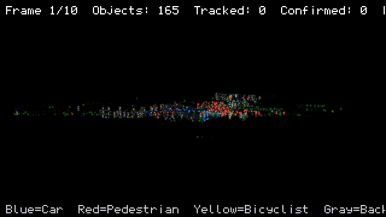

# Task 2: Optional Challenge

The optional challenge provides 10 sequential raw LiDAR scenes without any pre-segmentation. The task is to segment each frame into five classes (car, pedestrian, bicyclist, ground, background) and perform clustering and tracking for the car, pedestrian, and bicyclist classes.

&nbsp;

## Data Observations

I loaded and visually inspected the point cloud data. Each frame has roughly 184,000 points with 5 columns: x, y, z, intensity, and ring. Ring values go from 0 to 127, confirming this is a 128-beam LiDAR, likely a Velodyne style sensor.

The scene spans approximately 380m x 180m and shows an urban intersection. From the viewing angle it is clear the sensor is mounted above road level on a building or infrastructure pole, looking downward at an angle. This is consistent with an infrastructure-based perception deployment.

One important observation: the sensor is tilted. The ground plane is not aligned with the z-axis. This affects every downstream step because simple z-thresholding won't separate ground from objects. I had to account for this tilt throughout the pipeline.

Some frames have z-outliers as low as -73m which I clipped out early in the pipeline.

&nbsp;

---

&nbsp;

## Pipeline Overview

The full perception pipeline processes each frame through five stages:

1. Ground removal (calibrate once, apply per frame)
2. Clipping in the rotated coordinate frame
3. BEV grid clustering with connected components
4. Single-stage RF classification (reusing the classifier from Task 1)
5. Multi-object tracking with Kalman filter and Hungarian assignment

Each stage was developed iteratively with multiple failed approaches before arriving at the final solution. I'll walk through the key decisions and failures for each stage.

&nbsp;

---

&nbsp;

## Ground Removal

This was the hardest part of the pipeline. I went through six iterations before arriving at a solution that worked reliably across all 10 frames.

### Iteration 1: Per-Frame RANSAC

My first attempt was naive RANSAC on the full scene for each frame. I set the distance threshold to 0.3m (road surface roughness plus LiDAR noise at 128-beam resolution). I also added a horizontal normal check where abs(normal[2]) < 0.7 rejects candidate planes that are too tilted, which prevents RANSAC from locking onto building walls.

It failed. RANSAC locked onto car roofs instead of the ground because the roof of a bus has more coplanar points in a local region than the actual road surface. Also it took 6-7 seconds per frame which is way too slow.

### Iteration 2: Rotation + Flat Threshold

I noticed the sensor is mounted at an angle facing the road. Since the infrastructure mount is fixed, I only need to calibrate the rotation once for the first frame and reuse it for all subsequent frames.

The approach: run RANSAC only on nearby points within 10m of the sensor origin. Near the sensor, ground dominates with dense concentric scan lines on the road directly below, no car roofs, no distant buildings. This gives a clean ground normal representing the sensor tilt. I compute a rotation matrix using Rodrigues' formula to align this normal with z-up, making ground horizontal in the rotated frame. Then a simple z-threshold separates ground from objects.

Latency went from 6-7 seconds to 5-10ms per frame. But the flat threshold missed ground at far range where the road slopes, and sometimes caught pedestrians at range.

### Iteration 3: Grid + Local Percentile

I added a Cartesian XY grid (1.5m cells). For each cell I compute the 10th percentile of z as the local ground height, then validate against calibration: if the cell's ground height deviates more than 0.2m from the calibration value, it's probably an object (like a bus bottom), so I fall back to the calibration height.

This helped with road slope but created a new problem. In cells occluded by large objects like buses, the local minimum was the bus bottom, not the road. The percentile was wrong for those cells.

### Iteration 4: Blanket from All Frames

I tried computing a ground height map from multiple frames hoping that the road would be visible in different frames as objects move. Only 1-5% of cells had valid ground estimates. Not enough coverage. Abandoned this approach.

### Iteration 5: Expected Height Field

I tried using the plane equation to compute expected ground height at each XY location: expected_z(x,y) = -(nx*rx + ny*ry + d)/nz. The idea was that even if a cell is occluded, we know what ground height to expect from the plane.

The problem: even a tiny residual tilt (0.01 in nx after rotation) creates 2m of drift at 100m range. The expected height field extrapolated up to car roof level at far range. The plane was too sensitive to work at distance.

### Iteration 6: Polar Grid + Adaptive Deviation (Final)

So I rolled back to the constant calibration height but made two key changes.

First, I replaced the Cartesian XY grid with a polar (r, theta) grid. The sensor naturally sees the world in polar coordinates, dense concentric arcs near the sensor, sparse points at range. A Cartesian grid has the wrong resolution everywhere: too coarse near (missing detail) and too fine far (empty cells). The polar grid matches the data density naturally. I settled on 5m radial bins and 5-degree angular bins.

The key insight with polar bins: a bus only covers a limited angular span. In a Cartesian grid, the entire cell might be filled by the bus, making the percentile wrong. In a polar wedge, adjacent wedges still see the road beside the bus, keeping the ground estimate correct.

Second, I replaced the constant deviation threshold with distance-adaptive scaling. Near the sensor, tight validation (0.5m) reliably rejects vehicles. At far range, the threshold relaxes (up to 2.0m) to accommodate road slope. The formula is: allowed_deviation = min(0.5 + r * 0.08, 2.0).

I also replaced np.percentile with np.partition for the per-bin ground height calculation. np.percentile sorts the entire array at O(N log N) while np.partition uses quickselect at O(N) to find the k-th smallest element without sorting. For ~3,600 polar bins this brought ground removal latency from ~200ms to ~100ms per frame.

### Ground Removal Verification

Since there are no ground truth labels for the optional challenge data, I verified ground removal through:

1. Visual inspection across all 10 frames: road surface correctly marked as green, vehicles and buildings remain non-ground
2. Cross-frame consistency: ground percentage stable at 11.7-12.2% across all frames (±0.5%)
3. Minor wall-base leakage at ground level, but this is cosmetic and gets handled by the classifier downstream

On a side note, for a production infrastructure deployment the cleanest approach would be background subtraction. Accumulate scans over a period and see what doesn't change between scans. That gives you a reference map of the empty scene. Per frame you just compare each point against the reference. O(1) per point, ~1ms for 184k points. I couldn't do this here because we don't have empty scene frames, but it would be the production approach.

&nbsp;

---

&nbsp;

## Clipping

Before clustering I clip the point cloud to remove far-range buildings and high structures that aren't relevant for object detection. The important detail: clipping must happen in the rotated coordinate frame, not the raw sensor frame. Because the sensor is tilted, raw z=10m might be ground at far range, and raw XY distances are skewed by the tilt.

After rotation, z is true height above ground and XY is true horizontal range. I clip to:
- 80m horizontal range (beyond this is mostly buildings)
- 3m above ground (removes tree canopy that was bridging objects in BEV)
- 1m below ground (noise tolerance)

The 3m height limit was originally 10m. I tightened it after observing that tree foliage above parked cars was causing them to merge into one giant cluster in the BEV grid.

*Figure on top the car was not classified correctly because it had noise from tree overhang, after reducing z to 4m it was classified correctly*

This reduces the point count from ~184k to ~153k per frame.

&nbsp;

---

&nbsp;

## Clustering

After ground removal I have roughly 140k non-ground points per frame. I needed a clustering algorithm that could handle this volume within real-time latency.

### DBSCAN

DBSCAN was my first thought. But DBSCAN on 140k points would take minutes because of the O(N^2) distance computations, even with KDTree acceleration. I did verify that the training data and optional challenge data have compatible point spacing (both are raw sensor data, not voxelized) by comparing nearest-neighbor distance distributions. Training clusters have std/mean ratio of 0.5-0.8 and the raw scene has 1.3, both indicating irregular raw LiDAR spacing. If the training data had been voxelized (uniform grid), the RF features would not transfer to raw DBSCAN clusters and we'd need to retrain.

### BEV Grid Connected Components

When I oriented the point cloud to bird's eye view, the clusters were clearly visible. From an elevated infrastructure sensor, objects separate naturally in the horizontal plane. A car and a pedestrian next to each other don't overlap vertically like they would from a vehicle-mounted sensor, they're side by side.

So I projected non-ground points to a 2D occupancy grid at 0.15m resolution (matching the sensor's point spacing of ~0.09-0.12m). A cell is occupied if it has at least 2 points. Then scipy's ndimage.label does flood-fill connected component labeling. This is O(N) for the grid projection and O(grid_size) for the labeling. Much faster than DBSCAN.

### 4-Connectivity vs 8-Connectivity

I started with 8-connectivity where diagonal cells count as connected. This was too aggressive. A car parked next to a wall or roadside curb had one diagonal cell bridging them, merging car and wall into one giant cluster that gets rejected by the size filter. The car vanishes.

Switching to 4-connectivity (shared edges only, no diagonals) fixed this. Objects need to share a cell edge to be connected, making accidental bridging much harder.

### Morphological Opening: Tried and Reverted

I tried morphological opening (erode then dilate) to break thin bridges between objects. The problem: small pedestrians at range only occupy 2x2 cells in the 0.15m grid. A 3x3 erosion kernel erased them completely. Dilation can't restore what's gone. Reverted immediately. 4-connectivity alone was sufficient.

### Two-Stage Ground Trim

A pattern I've seen used by engineers in production stacks: after clustering, check each cluster's height. If the cluster is tall (z_range > 0.5m), trim the bottom. After clustering, each cluster is checked for ground leakage at its base. If the cluster's lowest point is within 0.25m of the calibrated ground height AND the cluster has at least 0.5m of z-range, the bottom 5% of points are trimmed using the 5th percentile as the cut threshold. This only activates for clusters that are actually sitting near the ground, so elevated objects like signs or overhead structures are left untouched.

### Per-Cell Height Filter: Tried and Reverted

I tried adding a per-cell minimum height filter (cell must have 0.3m z-range to be occupied). The idea was to reject flat ground patches before connected components. But car hatchback edges only have 2 scan rings with a z-spread of 0.1-0.2m. The height filter killed those edge cells, creating holes in the car outline, and connected components split the car into pieces. Moved height filtering to the cluster level where the full cluster has enough context.

### Cluster Post-Filters

After extracting clusters I filter by:
- min_points = 20 (smaller is noise)
- max_points = 15,000 (originally 5,000, increased to not reject buses)
- max_height = 5m (taller is building/tree)
- max_width = 15m (wider is merged structures)

The output is consistent: ~280-310 valid clusters per frame, ~900-1080 rejected as too small, ~1 rejected as too large. Stable across all 10 frames.

&nbsp;

---

&nbsp;

## Classification

I plugged in the RF classifier from Task 1 directly. The single-stage 4-class model extracts features for all ~300 clusters, stacks them into a single feature matrix, and calls model.predict() once in batch. This is significantly faster than per-cluster prediction because sklearn's RF predict has per-call overhead that dominates when called individually.

### Validating Feature Transfer

Before running classification I verified that the training data and optional challenge data come from the same sensor at the same resolution. I computed nearest-neighbor distance distributions for both:

| Data Source | NN Mean | NN Std | Std/Mean |
|:---|---:|---:|---:|
| Training cars | 0.06-0.09m | 0.03-0.06m | 0.5-0.7 |
| Training pedestrians | 0.08-0.12m | 0.05-0.07m | 0.5-0.6 |
| Raw scene | 0.12m | 0.16m | 1.3 |

Both show irregular spacing (high std/mean ratio). If the training data had been voxelized, std/mean would be below 0.3 with uniform minimum distances. Since both are raw sensor data, the RF features (density, nn_dist_std, hull_point_ratio, etc.) compute to similar distributions and the model transfers without retraining.

### Physical Sanity Heuristics

On top of the RF predictions I added physical sanity checks to catch impossible classifications:
- A "pedestrian" wider than 1.4m or shorter than 0.7m above ground gets reclassified as background
- A "car" wider than 7m or shorter than 0.5m above ground gets reclassified as background
- A "bicyclist" wider than 2.6m or narrower than 0.8m gets reclassified as background

These catch the cases where the RF confidently predicts the wrong class because the cluster happens to have the right feature distribution but physically impossible dimensions.

### Per-Frame Results

The pipeline produces roughly 155-175 object classifications per frame:

| Class | Average per Frame |
|:---|---:|
| Pedestrian | ~130 |
| Car | ~19 |
| Bicyclist | ~11 |
| Background | ~140 |

The pedestrian count is high because this is a busy intersection scene with many people crossing and walking on sidewalks. The split/merge step contributes to the count as merged pedestrian groups get separated into individual detections.

### Latency

With batched feature extraction and prediction, the 23-feature mode classifies all ~300 clusters in 500-1200ms per frame. The total pipeline latency including clipping, ground removal, clustering, split/merge, classification, and tracking is 1-2 seconds per frame.

&nbsp;

---

&nbsp;

## Tracking

The final stage is multi-object tracking on the classified car, pedestrian, and bicyclist clusters across the 10 sequential frames.

### Architecture

I built a Kalman filter tracker with Hungarian assignment. Standard production approach that I've implemented multiple times at Toyota TTI and TierIV.

Each track maintains a 6-dimensional state: [x, y, z, vx, vy, vz] representing position and velocity. The measurement is the cluster centroid [x, y, z]. I use a constant velocity motion model which is sufficient for a 10Hz sensor with 10 frames.

### Track Lifecycle

- Birth: An unmatched detection creates a new tentative track
- Confirmation: A track with 2 or more matched detections becomes confirmed
- Coasting: An unmatched track predicts forward without update, incrementing its miss counter
- Death: Tentative tracks die after 1 miss. Confirmed tracks die after 3 consecutive misses.

Initially I had the same death rule for both. But false detections showed up once and vanished. A real object got detected in consecutive frames. Killing tentatives after 1 miss removed ghost tracks immediately while confirmed tracks still bridged temporary occlusion.

### Data Association

I used Euclidean distance with a fixed 5m gate. It worked but was crude. The Kalman filter already estimates uncertainty in its covariance matrix P, and Euclidean distance ignores that entirely. A new track with unknown velocity has large uncertainty and should accept matches from further away, while a well-established track with tight covariance should be strict.

So I switched to Mahalanobis distance. The innovation y = measurement - predicted gets weighted by the innovation covariance S = H*P*H' + R, giving d² = y' * S⁻¹ * y. I gate at d² > 7.81 which is the chi-squared 95% threshold for 3 degrees of freedom. This is standard and replaced the fixed distance gate completely.

I also added class-aware gating: if a track has an established class label and a detection has a different class, the assignment gets blocked (prohibitive cost). This prevents a car track from stealing a nearby pedestrian detection. One consideration was whether this is too aggressive since the classifier flips pedestrian/bicyclist about 15% of the time. But in practice most flips happen across frames on different clusters, not on the same tracked object. The hard gate eliminated cross-class identity switches without noticeable track loss.

### Temporal Class Voting

Each track maintains a confidence-weighted vote history. When a detection matches a track, the detection's class and confidence get accumulated. The track's label is the class with the highest average confidence across all its votes. To prevent noisy frame-to-frame flipping, I added a 0.15 hysteresis: the track only switches class if the new best class beats the current one by at least 0.15 in average confidence. So a track labeled "car" across 8 frames at 0.85 average confidence won't flip to "pedestrian" because of one confused frame. In practice this stabilized most labels by frame 3 or 4.

### Why Not Track Everything

I considered tracking all ~300 clusters instead of just the ~160 object clusters. The idea was to let the tracker kill false alarms instead of relying on the classifier. But Hungarian is O(N^3). 300^3 vs 160^3 is a 6.6x difference. Also, ~140 background clusters would create permanent static tracks that clutter the system since they appear at the same location every frame. The classifier as a first filter reduces tracker input and eliminates the static background problem.

### Kalman Parameters

| Parameter | Value | Reasoning |
|:---|:---|:---|
| dt | 0.1s | Computed from file timestamps (10.1 Hz) |
| Process noise (position) | 0.5 | Road objects, moderate acceleration |
| Process noise (velocity) | 2.0 | Objects can start/stop between frames |
| Measurement noise | 0.3 | Cluster centroid jitter from BEV grid |
| Initial position uncertainty | 0.5 | Centroid is fairly precise at birth |
| Initial velocity uncertainty | 10.0 | Velocity completely unknown at birth |
| Gate (Mahalanobis d²) | 7.81 | Chi-squared 95% at 3 DOF |
| Class-aware gating | Hard block | Prevents cross-class identity switches |
| Max misses (confirmed) | 3 | Bridges temporary occlusion |
| Max misses (tentative) | 1 | Kills false alarms immediately |
| Confirm hits | 2 | Confirmed after 2 matched detections |

The covariance initialization was originally P_pos=1.0 and P_vel=5.0. I found this was too uncertain on position (relative to R=0.3) and too confident on velocity (unknown at birth). Changing to P_pos=0.5 and P_vel=10.0 made early predictions less jittery and the filter converged faster.

### Real Data Results

| Frame | Detections | Confirmed Tracks | Killed |
|:---|---:|---:|---:|
| 1 | 160 | 0 (all tentative) | 0 |
| 2 | 156 | 134 | 26 |
| 3 | 159 | 146 | 10 |
| 4 | 161 | 161 | 14 |
| 5 | 154 | 164 | 10 |
| 6 | 160 | 168 | 10 |
| 7 | 158 | 172 | 14 |
| 8 | 158 | 174 | 8 |
| 9 | 173 | 179 | 9 |
| 10 | 166 | 184 | 10 |

Total unique tracks across 10 frames: 197. Final frame: 150 pedestrian, 21 car, 13 bicyclist. The tracker runs in under 0.5 seconds on all 10 cached frames.

The confirmed track count grows steadily from 134 in frame 2 to 184 in frame 10 as more objects get confirmed through repeated association. The kill rate of 8-26 tracks per frame shows the tracker actively removing false detections and transient objects. Track-guided splits become more frequent in later frames (up to 9 per frame by frame 8) as the tracker accumulates enough history to guide cluster separation.

The tracking ratio (tracked/detected) is consistently high: 90-99% of detected objects are matched to confirmed tracks from frame 3 onward, indicating stable associations.

*Full scene with clusters marked: car - blue, pedestrians - red, bicyclists - yellow, background - grey*

*Clusters marked ith tracker dot on top of bounding box*

&nbsp;

---

&nbsp;

## Pipeline Latency Summary

| Stage | Latency per Frame | Notes |
|:---|---:|:---|
| Clipping | ~10-80ms | Rotation + range/height filter |
| Ground removal | ~30-80ms | Polar grid + adaptive deviation |
| BEV clustering | ~290-770ms | Grid projection + connected components |
| Split + merge | ~20-130ms | PCA gap-finding + track-guided + engulfed merge |
| Classification (23-feat) | ~500-1200ms | Batched feature extraction + predict |
| Tracking | <50ms | Kalman + Hungarian on ~160 detections |
| **Total (23-feat)** | **~1.0-2.2s** | **Near real-time with optimization** |

With 19-feature compact mode the full pipeline runs at ~570ms per frame (1.7 Hz). The two bottlenecks are BEV clustering (~260ms) and classification (~190ms). Clustering is slow because of Python-level scatter operations (np.add.at, np.minimum.at) and the extraction loop over ~1200 components. Classification runs at 0.6ms per cluster for ~300 clusters. 

Replacing scatter ops with np.bincount and precomputing per-cell statistics during grid projection (PointPillars-style pillarization) would eliminate the re-scan during cluster extraction. For the classification side, moving feature extraction to C++ would cut per-cluster time to ~0.05ms. Together these bring the pipeline under 200ms. GPU-accelerated grid projection would push it further to the 100ms target for 10Hz operation.

&nbsp;

---

&nbsp;

## Known Limitations

**Consistent misses:** A parked car that gets classified as background in every frame never enters the tracker. The tracker handles intermittent misses (bridges 1-2 frame gaps) but cannot recover objects that are consistently missed by the classifier. For production, a static object detection module that promotes persistent detections regardless of class would address this.

  
  

**Pedestrian groups classified as cars:** When multiple pedestrians walk close together, BEV connected components merges them into one cluster. The combined shape has car-like dimensions (wide footprint, moderate height) and the RF classifies it as a car. The PCA gap-finding split catches cases where pedestrians are roughly in a line, but fails when they form an L-shape or triangle with no clear principal split axis. The track-guided split helps in later frames once individual tracks have been established, but the initial misclassification persists until the group separates. A density-based sub-clustering step (mini-DBSCAN within the cluster at tighter eps) or a learned pedestrian group detector would address this.

  
  

**No ground truth evaluation:** Without labeled optional challenge data, all evaluation is visual inspection plus consistency metrics (ground percentage stability, cluster count stability, track count stability). The RF accuracy numbers from Task 1 (0.80 macro-F1) are the best proxy for per-cluster classification quality.

**Bicyclist confusion:** As documented in Task 1, elongated background structures (wall fragments, fences) share geometric properties with bicyclists in feature space. With only 1,305 bicyclist training samples, the RF can't fully learn the boundary. A side-view fill ratio feature (XZ occupancy grid density) would help distinguish filled rectangular surfaces from irregular human+bicycle silhouettes.

  
  

&nbsp;

---

&nbsp;

## Pipeline Demo

10 sequential LiDAR frames processed through the full pipeline - ground removal, 
BEV clustering, split/merge, RF classification, and Kalman filter tracking. 
Blue = car, red = pedestrian, yellow = bicyclist, gray = background, green = ground. 
Bounding boxes show classified objects, dot markers show tracked object IDs.

Full resolution video: `pipeline_demo.mp4`

## Production Improvements

If I had more time or this were a production deployment, I would pursue:

**Background subtraction model:** For a fixed infrastructure sensor, accumulate a reference map of the empty scene in (azimuth, ring_id) coordinates. Per frame, compare each point's distance against the reference. O(1) per point. Ground and static background removed in ~1ms. No RANSAC, no polar grid, no grid search.

**Patchwork++ ground removal:** The current polar grid approach is conceptually similar to Patchwork++ (Lee et al., 2022) but simplified. Patchwork++ fits local planes per patch instead of just a percentile, uses temporal consistency across frames, and has adaptive zone sizing. Would improve ground removal on complex terrain.

**PointNet classifier:** Replace the handcrafted feature extractor with PointNet operating directly on cluster point clouds. Would capture scan-line regularity that handcrafted features miss. Potentially also try pointNet features extracted and fed into RF along with our hand-crafted features.

**Track shape consistency:** Temporal class voting is already implemented. The next step would be shape consistency checks: if a track's cluster dimensions change drastically between frames (xy_spread doubles, z_range halves), flag the association as suspicious rather than accepting it. This catches cases where two nearby objects swap identity because the Hungarian assignment found a lower-cost but physically wrong match.
